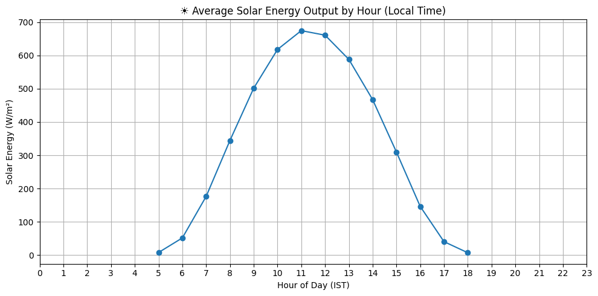
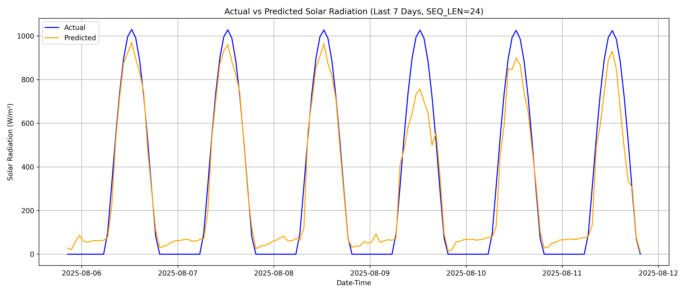

# 🌞 Weather-Net (Solar Energy Prediction)

This project builds a deep learning model to forecast hourly solar energy output (W/m²) using weather features from NASA's POWER API. It includes a `FastAPI` server for making real-time predictions using geographic coordinates. It has a Latency of `35 ms`

---

## 📦 Features

* Predict next hour’s solar irradiance (ALLSKY_SFC_SW_DWN)
* Uses historical hourly weather data (past 24h)
* FastAPI endpoints for real-time predictions and recent actual data
* Model built using a spike-aware hybrid CNN-LSTM-Attention architecture (`SpikeAwareHybrid`)

---

## 🧠 Model Architecture

* **Input:** 24 hourly sequences of 14 weather features
* **Model:** SpikeAwareHybrid (CNN + LSTM + Multihead Attention)
    - Multi-scale CNN feature extraction (trend + spike detection)
    - Bidirectional LSTM for temporal dependencies
    - Multihead Attention for context
    - Global mean/max pooling for robust spike-aware prediction
* **Output:** Next hour solar energy prediction (in W/m²)

---

## 📷 Images

* Actual Vs Predicted  
  
* Average Hourly Solar Prediction  
  
* On Live Data Never Seen Before  
  

---

## 🚇 Metrics

* RMSE Error = 118.63706223892275
* MAE = 97.60
* R2 socre =   0.9136192701253345

---

## 📁 Project Structure

```
weather_net/
├── final/
│   └── dataset.py
├── models_code/
│   ├── model_5.py             # Spike-aware hybrid CNN + LSTM + Attention architecture
│   ├── model_3.py             # LSTM-Attention model
│   └── other models…
├── scalers/
│   ├── feature_scaler_seq24.pkl
│   ├── feature_scaler_seq12.pkl
├── models/
│   ├── spike_aware_q95_seq24.pth
│   ├── spike_aware_q95_seq12.pth
│   ├── version2.pth
│   └── other model weights…
├── training_codes/
│   ├── training_5.py
│   ├── training_6.py
├── final_fetch.py             # Preprocessing & Weatherbit integration
├── main.py                    # FastAPI server
├── pred.py                    # CLI prediction script
├── test_prediction_plot.py    # Local 7-day evaluation script
├── requirements.txt
└── readme.md
```

**Descriptions:**
- **final/** — Data handling and sequencing logic (PyTorch Dataset class)
- **models_code/** — All model architectures (CNN, LSTM, Transformer, hybrids, etc.)
- **scalers/** — Saved feature scalers used during training/inference
- **models/** — Saved PyTorch weights for trained model versions
- **training_codes/** — Python scripts used to train models (with spike-aware logic)
- **final_fetch.py** — Weatherbit API fetching + feature harmonization (TOA, clipping, night masking)
- **main.py** — FastAPI server providing live prediction and recent data endpoints
- **pred.py** — CLI for predicting the next hour's value from console
- **test_prediction_plot.py** — Script to compare predictions vs real for the past 7 days and plot results

---

## 🚀 Running the API Server

1. **Install dependencies**:

   ```bash
   pip install -r requirements.txt
   ```

2. **Start FastAPI server**:

   ```bash
   uvicorn main:app --reload
   ```

3. **Test API in browser**:  
   Open: [http://127.0.0.1:8000/docs](http://127.0.0.1:8000/docs)

---

## 📥 API Usage

### 1️⃣ Predict Next Hour Solar Irradiance

**Endpoint:**
```
GET /predict_current
```

**Test URL (Delhi, India):**
[http://127.0.0.1:8000/predict_current?lat=28.6139&lon=77.2090](http://127.0.0.1:8000/predict_current?lat=28.6139&lon=77.2090)

**Response Example:**
```json
{
  "latitude": 28.6139,
  "longitude": 77.2090,
  "timestamp_predicted_ist": "2025-08-02 14:00:00",
  "predicted_next_hour_wm2": 378.65
}
```

---

### 2️⃣ Get Last 7 Hours Actual Solar Data

**Endpoint:**
```
GET /last_7hours_real
```

**Test URL (Delhi, India):**
[http://127.0.0.1:8000/last_7hours_real?lat=28.6139&lon=77.2090](http://127.0.0.1:8000/last_7hours_real?lat=28.6139&lon=77.2090)

**Response Example:**
```json
{
  "latitude": 28.6139,
  "longitude": 77.2090,
  "data": [
    {"timestamp_ist": "2025-08-02 07:00:00", "ghi_wm2": 512.34},
    {"timestamp_ist": "2025-08-02 08:00:00", "ghi_wm2": 498.21},
    ...
  ]
}
```

---

## 🛰️ Data Source
Training Data:
* [NASA POWER API](https://power.larc.nasa.gov/)
* Features used:
  * `ALLSKY_SFC_SW_DIFF`, `ALLSKY_SFC_SW_DNI`, `TOA_SW_DWN`
  * `RH2M`, `QV2M`, `PS`, `WS2M`, `CLOUD_AMT`
  * `ALLSKY_SFC_LW_DWN`, `T2M`, `ALLSKY_SFC_SW_DWN`
  * Cyclic time features: `hour_sin`, `hour_cos`, `month_sin`, `month_cos`
Prediction Data:
*[OpenMeteo API](https://open-meteo.com/)
*Same features used to predict the solar energy generated. However, two features:
*1. Relative Humidity at 2m.
*2. Top of atmosphere shortwave downward radiation.
*Were not available, thus they are calculated in the code itself.
---

## 🛠 Tech Stack

* **Language:** Python 3.10+
* **Framework:** FastAPI, PyTorch
* **Data Fetching:** NASA POWER API, Weatherbit API
* **Model:** SpikeAwareHybrid (CNN + LSTM + Attention)

---

## 📄 License

MIT License © 2025

---
